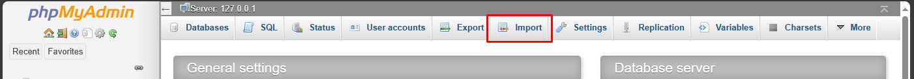
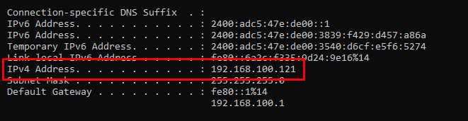

# LoanLy | Loan Management System

## Introduction

<p style="text-align: justify">LoanLy is a simple and secure website to manage and keep track of the money you have lent or borrowed. It allows you to add lenders, borrowers, and loans with optional details such as images and dates. It also displays all the lenders, borrowers, and loans in a user-friendly interface. LoanLy does not store any data on any server, but rather uses a local MySQL database to ensure your privacy and security.</p>

## Why This System?

<p style="text-align: justify">The data we deal with when it comes to personal loans can be quite sensitive. We don't always want to upload this data to a server due to privacy concerns. That's why this system is designed to run locally, keeping your data secure and private.</p>

## Features
- **Add Lender:** Add a new lender or borrower with a name
- **Lenders:** View all the lenders or borrowers in a table with their names
- **Add Loan Record:** Add a new loan with the following information:
  - Lender name (selected from a dropdown list of existing lenders)
  - Borrower name (selected from a dropdown list of existing borrowers)
  - Amount lent
  - Image to attach (optional) - you can attach any screenshot of the digitally transferred amount to keep track of the transaction
  - Date when loan was given (optional) - if not specified, the current timestamp is used
- **Loan Records:** View all the loans in a table with their lender name, borrower name, amount, image thumbnail, and date
- Click on the image thumbnail to open it in a full screen mode where you can see the details of the screenshot attached

## Installation
<p style='text-align:justify'>To run LoanLy, you need to have PHP and MySQL installed and running on your system, I am using XAMPP server. After installing and runnin gthe Apache Server and MySQL server, go to phpmyadmin page and click on import and import the `loan_management.sql` file provided in the repository. This would create a database named `loan_management` and setup all the necessary tables and views.</p>



<p style="text-align: justify">Now copy all the files and folders of the repository and  navigate to the htdocs folder in your XAMPP directory. Here, create a new folder named loan_management and paste the copied files in it. Now go to your browser and type the following

```
localhost/loan_management
```
</p>

This would take you to the index or Home page of the website.

## Usage
To use LoanLy, you can follow these steps:
- To add a new lender or borrower, click on the `Add Lender` button on the top right corner of the homepage. Enter the name and the optional description of the lender or borrower and click on the `Submit` button.
- To view all the lenders or borrowers, click on the `Lenders` button on the top right corner of the homepage. You will see a table with the names and descriptions of all the lenders or borrowers.
- To add a new loan, click on the `Add Loan` button on the top right corner of the homepage. Select the lender name and the borrower name from the dropdown lists, enter the amount lent, and optionally attach an image and specify a date. Click on the `Submit` button.
- To view all the loans, click on the `Loans` button on the top right corner of the homepage. You will see a table with the lender name, borrower name, amount, image thumbnail, and date of all the loans. You can click on the image thumbnail to open it in a full screen mode.

## How to view it on Mobile

<p style='text-align:justify'>In order to open the website on your mobile phone, both your computer/laptop and mobile should be conected to same network. Now open the command prompt by pressing <font face=Marlett>&#x57;</font> + R button and typing cmd and hit enter. When the cmd opens type ipconfig and hit enter. Now note down the IPv4 address and open any browser in your mobile phone and type the following</p>

```
your-IPv4-address/loan_management
```
replace your-IPv4-address by the IP address you got from CMD. Now your website would successfully run on your mobile phone.



## Future Improvements

<p style="text-align: justify">While this system is fully functional and ready to use, there's always room for improvement. Future updates may include features like sorting and filtering loan records, sending reminders for unpaid loans, and more.</p>

## Conclusion

<p style="text-align: justify">Managing personal loans doesn't have to be a hassle. With this Personal Loan Management System, you can easily keep track of all your loans and never forget about the money you've lent out again. Enjoy using the system!</p>
